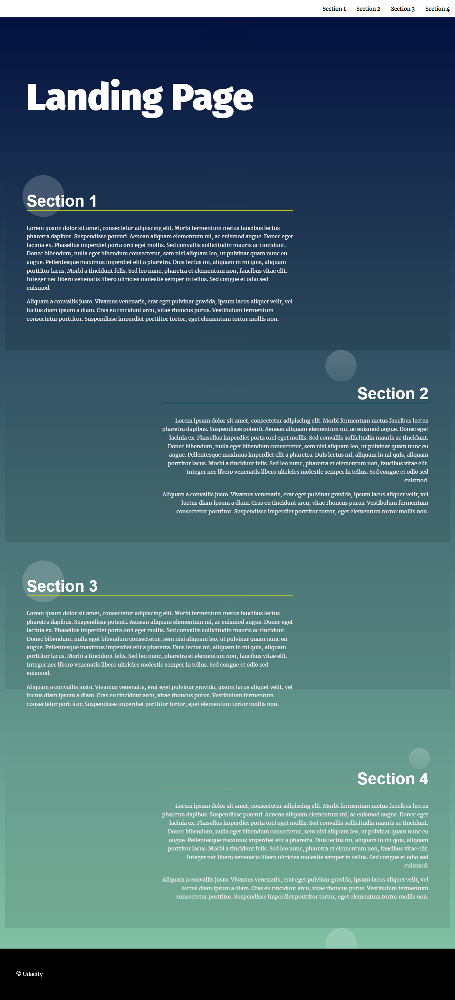

# Landing Page Project
This is a  landing page Project that uses Javascript to create a Navbar dynamically and to scroll to  sections  The i use HTML & CSS & & JS
# deployed on 
https://marstarek.github.io/Udacity-Landing-Page/
 #  resources
 https://developer.mozilla.org/en-US/docs/Web/API/Element/getBoundingClientRect
https://www.w3schools.com/howto/howto_js_scroll_to_top.asp
https://www.delftstack.com/howto/javascript/scroll-to-element-in-javascript/
https://developer.mozilla.org/en-US/docs/Web/API/NodeList
# GitHub Link
 To view the project  https://github.com/marstarek/Udacity-Landing-Page 

# Steps to run the project
open HTML file in the browser
# screenshot
